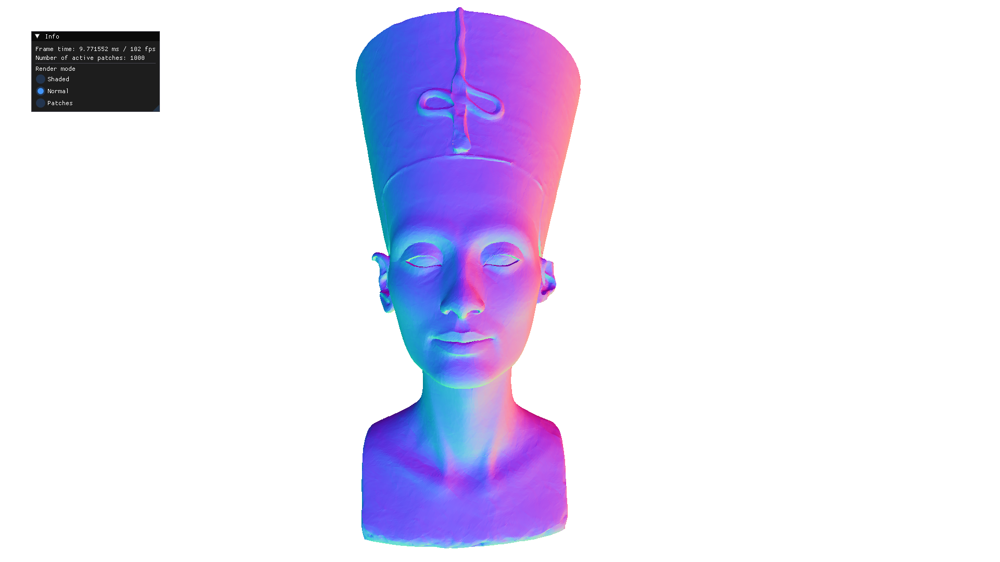

# Neural Geometry Fields for Meshes


# Usage

Training neural geometry fields requires an NVIDIA GPU with CUDA support. The
necessary python packages are listed in `requirements.txt` so installing them
with `pip install -r requirements.txt` is simplest. If there are errors in
install the library in `extensions` it can likely be resolved by installing
PyTorch and/or Wheel.

Then run `python source/train.py` on any target mesh:

```
usage: train.py [-h] [--mesh MESH] [--lod LOD] [--features FEATURES] [--display DISPLAY] [--batch BATCH] [--fixed-seed]

options:
  -h, --help           show this help message and exit
  --mesh MESH          Target mesh
  --lod LOD            Number of patches to partition
  --features FEATURES  Feature vector size
  --display DISPLAY    Display the result after training
  --batch BATCH        Batch size for training
  --fixed-seed         Fixed random seed (for debugging)
```

The results of the training will be placed into a local `results` directory as follows:

```
results
├── binaries           (Binaries for trained neural geometry fields)
├── loss               (Loss plots)
├── meta               (Generic metadata)
├── quadrangulated     (Partitioned surfaces)
├── stl                (Final surfaces exported as STLs)
└── torched            (Pytorch binary data)
```

The memory usage is relatively modest (under 8 GB for the default 1K patches
and 10 feature channels), but it can be adjusted with the batch size option.

Some tips to consider if errors appear:

- The STL format for meshes is most reliable; if the program complains from the
  meshio library, try again with a STL rather than an OBJ or etc.
- PyMeshLab is used for simplification and quadrangulation, but the execution
  is not always reliable. For this reason we time out the quadrangulation process
  after a minute. If this happens, the target mesh is likely too large.

# Rasterizer



Source code for the real-time rasterizer is provided in the `rasterizer`
directory. The only dependencies for building the program are GLFW and Vulkan;
the rest (ImGui and glm) are provided as submodules of this project. We rely on
CMake to compile the program:

```
cmake -B build .
cmake --build build -j
```

To run the rasterizer, run the resulting `build/testbed` executable by
providing a path to the neural geometry field binary file (e.g. within
`results/binaries`):

```
./build/testbed results/binaries/nefertiti-lod1000-f20.bin
```

# Citation

```
@inproceedings{vs2024ngfs,
  title = {Neural Geometry Fields for Meshes},
  author = {Sivaram, Venkataram and Ramamoorthi, Ravi and Li, Tzu-Mao},
  numpages = {11},
  year = {2024},
  series = {SIGGRAPH '24}
}
```
